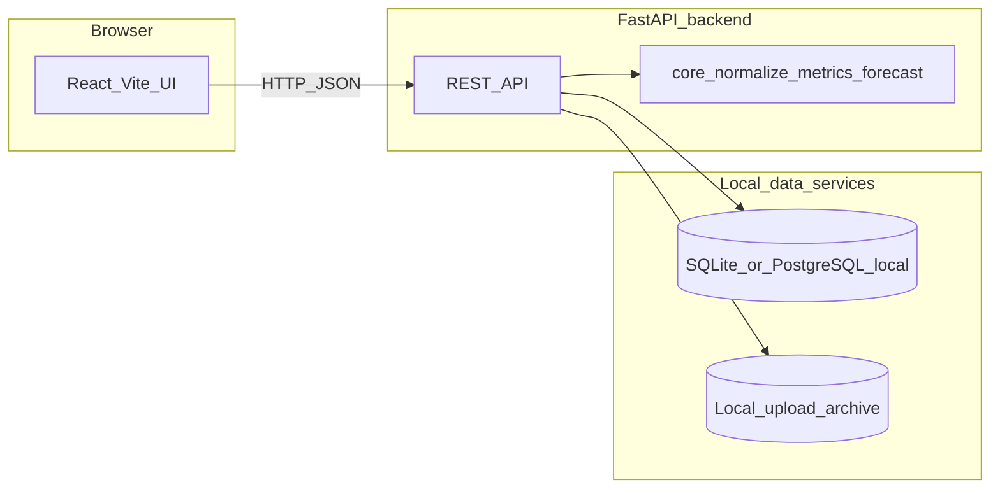

# Finance Health Dashboard

Full-stack demo for finance KPIs: upload financial data CSVs, compute deterministic metrics and forecasts, and explain results with a local deterministic endpoint (no cloud services required).

## System design



- **UI** loads KPIs, uploads CSVs, and calls explain; it never sends raw ledger rows to the model (only server-side KPI snapshots are used in the AI path).
- **SQLite (default)** or local PostgreSQL stores normalized `LedgerEntry` rows.
- Upload archives are stored locally under `backend/uploads` by default.
- `/api/explain` uses deterministic local logic grounded on KPI snapshots.

## Stack

- **Backend:** FastAPI, SQLAlchemy, SQLite (default) or local PostgreSQL
- **Frontend:** React (Vite), Recharts — dashboard calls the FastAPI API

## Repository layout

| Path | Role |
|------|------|
| `backend/main.py` | FastAPI app, CORS, `init_db()`, routers under `/api` |
| `backend/db/` | SQLAlchemy session, `LedgerEntry` model |
| `backend/core/` | CSV `normalize`, `compute_kpis`, `linear_forecast` |
| `backend/routes/` | `upload`, `kpis`, `explain` endpoints |
| `frontend/` | Dashboard calling `/api/kpis`, `/api/upload`, `/api/explain` |

Paths use `pathlib` where it matters so the backend runs on **Windows, macOS, and Linux**.

## Prerequisites (any OS)

- **Python 3.11+** (`python3` on Linux/macOS if `python` is not v3)
- **Node.js 18+** and **npm**
- **Git**

## Quick start

1. Clone the repository.
2. Copy environment template and edit secrets:

   ```bash
   cp backend/.env.example backend/.env
   ```

   On Windows PowerShell:

   ```powershell
   Copy-Item backend\.env.example backend\.env
   ```

3. Set **`DATABASE_URL`** in `backend/.env` (see template comments). Default uses SQLite and needs no extra setup.
4. Install and run **backend** and **frontend** (commands below).

## Backend setup

Create a virtual environment **inside `backend/`**, install dependencies, run Uvicorn **from `backend/`** so `load_dotenv()` finds `.env`.

### Windows (PowerShell)

```powershell
cd backend
python -m venv venv
.\venv\Scripts\Activate.ps1
pip install -r requirements.txt
python -m uvicorn main:app --reload --host 127.0.0.1 --port 8000
```

### macOS / Linux (bash or zsh)

```bash
cd backend
python3 -m venv venv
source venv/bin/activate
pip install -r requirements.txt
python -m uvicorn main:app --reload --host 127.0.0.1 --port 8000
```

### Listen on all interfaces (e.g. test from a phone on the same LAN)

Use `--host 0.0.0.0` instead of `127.0.0.1`, then open the UI with **`VITE_API_URL`** pointing at your machine’s LAN IP (see Frontend section). Add your dev origin to **`CORS_ALLOW_ORIGINS`** in `backend/.env` (comma-separated, no spaces unless inside the URL).

### Environment variables

Copy from [`backend/.env.example`](backend/.env.example). At minimum:

| Variable | Required | Notes |
|----------|----------|--------|
| `DATABASE_URL` | No | Defaults to `sqlite:///./finance_dashboard.db` if unset |
| `CORS_ALLOW_ORIGINS` | No | Comma-separated origins; defaults include `localhost` / `127.0.0.1` on ports 5173–5174 and 3000 |
| `LOCAL_UPLOAD_DIR` | No | Optional upload archive override path (default `backend/uploads`) |

- Swagger UI: http://127.0.0.1:8000/docs  
- Health: http://127.0.0.1:8000/health  

## Frontend setup

### Windows (PowerShell)

```powershell
cd frontend
npm install
npm run dev
```

### macOS / Linux

```bash
cd frontend
npm install
npm run dev
```

Open the URL Vite prints (usually **http://localhost:5173**). If the API runs on another host or port, create `frontend/.env`:

```env
VITE_API_URL=http://127.0.0.1:8000
```

Restart `npm run dev` after changing env files.

## API overview

| Method | Path | Description |
|--------|------|--------------|
| `POST` | `/api/upload` | Multipart CSV (`file`); normalizes rows, replaces rows for the first row’s `period`, bulk insert |
| `GET` | `/api/kpis` | Query `period` (default `2025`); returns KPIs + linear forecast |
| `POST` | `/api/explain` | JSON `{ "question": "..." }`; grounded on KPI snapshot only |

## Sample upload (cross-platform)

From the **`backend/`** directory, with the API running:

**bash / macOS / Linux**

```bash
curl -s -X POST "http://127.0.0.1:8000/api/upload" -F "file=@sample_data.csv"
```

**Windows PowerShell 5.1** (no `Invoke-RestMethod -Form`)

```powershell
curl.exe -s -X POST "http://127.0.0.1:8000/api/upload" -F "file=@sample_data.csv"
```

## Troubleshooting

| Issue | What to check |
|-------|-----------------|
| `DATABASE_URL` / driver errors | Use default SQLite for local dev, or install `psycopg2-binary` if switching to Postgres. |
| Browser “blocked by CORS” | Add your exact dev URL to **`CORS_ALLOW_ORIGINS`** in `backend/.env` (comma-separated). Restart Uvicorn. |
| `/api/explain` response is generic | Endpoint is deterministic/offline by design; upload more data for richer facts. |
| PowerShell: no `-Form` on `Invoke-RestMethod` | Use **PowerShell 7+** or **`curl.exe`** for multipart upload. |

## License

Use and modify per your course or organization policy.
